# Hospital Meal Planner & Inventory System (MOPH Manticao)
## Project Implementation Plan & Architecture Handbook

This document serves as the **shared context and roadmap** for the development of both the frontend (Vue 3) and backend (Laravel + MySQL) applications. Use this file to coordinate tasks, alignment, and vibe-coding sessions.

---

## 1. System Overview & JIT Model

Manticao Public Hospital (MOPH) uses a **Just-In-Time (JIT) procurement model**. 
* **No Large Warehouses:** The hospital does not store hundreds of kilograms of ingredients long-term. 
* **Daily Market Cycle:** 
  1. The **Dietitian** assigns meals to patients (budget limit: ₱150 per patient/day).
  2. The system aggregates all ingredients needed for those meals.
  3. A **Daily Market List** is generated for the **Purchasing Officer**.
  4. The Purchasing Officer buys ingredients at the market, logs the exact prices (receipts), and those items are added to stock.
  5. Once the **Kitchen Staff** finishes cooking, the ingredients are immediately **deducted** (backflushed).

---

## 2. Module & Screen Blueprint (Frontend Functionality)

We have completely revamped the frontend Vue 3 application to support this JIT workflow. Here is the exact breakdown of every portal, screen, and functionality that the backend needs to support:

### 🏥 Admin / Admissions Portal
Responsible for patient registration, discharge, and system user management.
* **1. Admissions Dashboard:** Displays KPIs like Total Admitted Patients, Pending Discharges, and Recent Admissions.
* **2. Patient Registration:** A form to admit new patients after doctor's consultation. Admitted patients instantly reflect on the Doctor portal.
* **3. Patient Records:** Patient history and record editing.
* **4. User Management:** Allows the Admin to create and manage accounts/passwords for all roles (Doctor, Dietitian, Purchasing Officer, Kitchen Staff, Food Server).

### 🩺 Doctor Portal
Responsible for medical assessments and prescribing diets.
* **1. Doctor Dashboard:** Displays KPIs like Active Patients and Total Diets Prescribed.
* **2. Patient Profiles:** Shows the list of patients added by Admissions.
* **3. Diet Prescriptions:** The doctor writes the diet prescription (e.g., "Low-Sodium", "Soft Diet"), adds allergen restrictions, and provides medical orders. This immediately pushes to the Dietitian's portal.
* **4. Diet History:** Tracks the historical prescribed diets and whether the meal has been served or is pending.

### 🥗 Dietitian Portal
Responsible for assigning daily meals within budget, planning, and reporting.
* **1. Dietitian Dashboard:** High-level KPIs (Meals planned today, Total budget used, Pending prescriptions).
* **2. Patient Profiles:** View patients and edit nutritional profiles.
* **3. Diet Prescriptions:** A detailed view of the doctor's prescriptions to guide meal planning.
* **4. Meal Assignment:** The core screen. The dietitian assigns Breakfast, Lunch, and Dinner based on the doctor's prescription. 
  * *UI Note:* Active Diet Groups are collapsible on the sidebar, Meal Assignment takes up the main view, and a Financial Summary tracks the ₱150 daily budget per patient.
  * Allows single patient (special orders) and batch assignments for multiple patients with the same diagnosis.
* **5. Meal Calendar:** Long-term meal planning view.
* **6. Dish Menu:** Where the dietitian creates and manages the hospital's recipes/dishes and maps their required ingredients.
* **7. Food Exchange AI:** An integrated AI chatbot that allows the dietitian to ask for Philippine Food Exchange list substitutes (e.g., "What can I substitute for 100g of pork?").
* **8. Service History:** Tracks assigned meals and their service status.
* **9. DOH Audit Report:** Generates downloadable Excel reports for the Department of Health (patients served, total ingredient costs, budget compliance).

### 🛒 Purchasing Officer Portal (JIT Workflow)
Responsible for daily market runs and logging receipts. *(Massively overhauled from the old design)*
* **1. Purchasing Dashboard (Daily Market List):** Instead of a traditional low-stock warehouse view, this screen aggregates all ingredients needed for tomorrow's assigned meals. 
  * The officer goes to the market, buys the items, and clicks **"Log Purchase"** to input the exact price paid.
  * Includes a **"Log Unplanned Purchase"** modal for budget adjustments or substitute ingredients bought at the market that weren't on the list.
  * Logging a purchase automatically adds the item to the hospital's inventory stock.
* **2. Purchase History & Receipts:** Tracks all incoming purchases and manual market receipts. (Replaced the old "Purchase Orders" and "Stock Movement" screens for simplicity).
* **3. Inventory Dashboard:** Shows current stock levels (which generally drop to zero daily after production).

### 🍳 Kitchen Staff Portal
Responsible for food production and inventory backflushing.
* **1. Production Schedule:** Displays the exact dishes and quantities to cook today based on Dietitian assignments. The staff clicks "Mark as Cooked" when food is ready.
  * *Crucial Backend Trigger:* Clicking "Mark as Cooked" triggers the **Inventory Backflush**, automatically deducting the exact ingredients used from the system's inventory.
* **2. Production History (Backflush History):** View all completed production items and the ingredients that were automatically deducted.

### 🍽️ Food Server Portal
Responsible for delivering meals to patient rooms.
* **1. Distribution List:** Displays the food assigned to each patient, their dietary prescriptions, and their room number.
* **2. QR Code Scanner:** The server scans a QR code on a ward/room door. The system instantly filters the list to show only the patients in that room, allowing the server to quickly "Mark All as Served".

---

## 3. Database Schema (MySQL)

We have created the migration files in the Laravel backend (`hospital-backend`). Here is the core structure of the tables:

```mermaid
erDiagram
    PATIENTS ||--o{ MEAL_ASSIGNMENTS : receives
    DISHES ||--o{ DISH_INGREDIENT : contains
    INGREDIENTS ||--o{ DISH_INGREDIENT : used_in
    MEAL_ASSIGNMENTS ||--o{ DISHES : includes
    PURCHASE_HISTORY ||--o{ PURCHASE_ITEMS : records

    PATIENTS {
        bigint id PK
        string name
        string room
        enum status "Active, Pending, Discharged"
        text diet_prescription
    }

    INGREDIENTS {
        bigint id PK
        string name
        string category
        decimal quantity
        string unit
        decimal unit_price
    }

    DISHES {
        bigint id PK
        string name
        enum meal_type "Breakfast, Lunch, Dinner"
        decimal cost
        int calories
    }

    MEAL_ASSIGNMENTS {
        bigint id PK
        bigint patient_id FK
        date date
        string breakfast_dish
        string lunch_dish
        string dinner_dish
        decimal total_cost
    }
```

---

## 4. Current Work: Backend To-Do List

For the developer continuing backend development:

### Step 1: Create Database Seeders
Seed the MySQL database with realistic initial data:
* **Dishes:** Regular dishes, low-sodium dishes, diabetic-friendly dishes.
* **Ingredients:** Rice, Chicken, Fish, Eggs, Vegetables, Cooking Oil, etc. (with mock stock quantities).

### Step 2: Build REST APIs
Build the following API endpoints in Laravel:
* **Authentication:** `POST /api/login` (Role-based: Dietitian, Purchasing Officer, Admissions, Kitchen Staff, Food Server).
* **Patients:** 
  * `GET /api/patients` (Filter active patients).
  * `POST /api/patients` (Register patient).
  * `PUT /api/patients/{id}` (Update info/discharge status).
* **Meal Assignments:**
  * `GET /api/meal-assignments` (Today's meal list).
  * `POST /api/meal-assignments` (Log a new daily assignment).
* **Purchasing & Receipts:**
  * `POST /api/purchases` (Submit logged receipts from market / unplanned purchases).
  * `GET /api/purchases/history` (Get purchase history).

### Step 3: Implement Backflushing (Stock Deduction)
* Create a controller method to calculate ingredient deductions.
* **Logic:** When the **Kitchen Staff** marks a production schedule as "Completed" for the day, the system must loop through all assigned meals for that day, find the corresponding ingredients (and quantities) for those dishes, and deduct those quantities from the `ingredients` table.

### Step 4: DOH Audit Reporting
* Create an endpoint to generate comprehensive reports for DOH (Department of Health) audits.
* **Logic:** The backend should compile data from `purchase_history` (expenses) and `meal_assignments` (budget adherence) and return a structured report.

### Step 5: AI Food Exchange Chatbot Integration
* The Dietitian portal includes a "Food Exchange AI" tool.
* **Logic:** Create a Laravel service that connects to an LLM API (like OpenAI or Gemini). Expose an endpoint (`POST /api/chat/food-exchange`) that takes a dietitian's query.

### Step 6: Database Triggers & Observers (Automation)
* Use Laravel Observers (or MySQL triggers) to automate background tasks.
* **Example 1:** When a patient's status changes to "Discharged", automatically trigger a job to cancel any future `meal_assignments`.
* **Example 2:** When a `purchase_history` record is inserted, automatically log an entry in the system activity logs.

---

## 5. How to Connect Frontend to Backend

1. In the Vue frontend, install Axios: `npm install axios`.
2. Configure a base API utility file (e.g., `src/utils/api.js`) pointing to `http://localhost:8000/api`.
3. Modify `src/stores/dataStore.js` to dispatch async actions using Axios instead of writing directly to `localStorage`.
