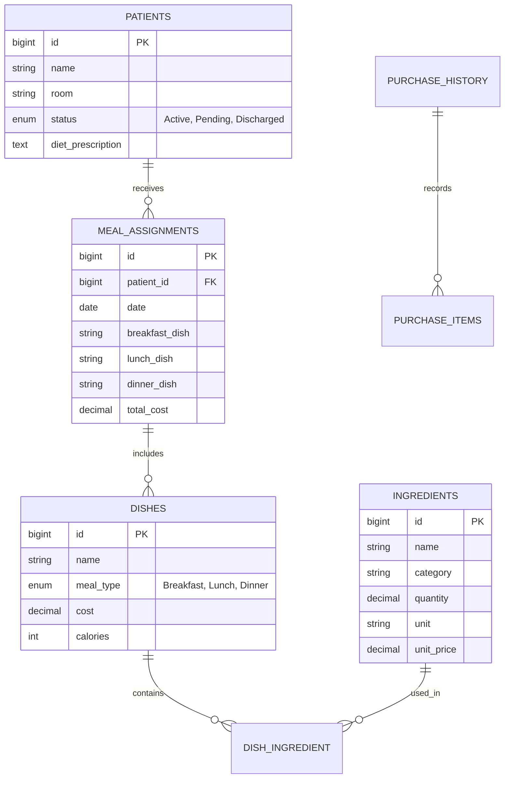

# Hospital Meal Planner & Inventory System (MOPH Manticao)
## Project Implementation Plan & Architecture Handbook

This document serves as the **shared context and roadmap** for the development of both the frontend (Vue 3) and backend (Laravel + MySQL) applications. Use this file to coordinate tasks, alignment, and vibe-coding sessions.

---

## 1. System Overview & JIT Model

Manticao Public Hospital (MOPH) uses a **Just-In-Time (JIT) procurement model**. 
* **No Large Warehouses:** The hospital does not store hundreds of kilograms of ingredients long-term. 
* **Daily Market Cycle:** 
  1. The **Dietitian** assigns meals to patients (budget limit: ₱150 per patient/day).
  2. The system aggregates all ingredients needed for those meals.
  3. A **Daily Market List** is generated for the **Purchasing Officer**.
  4. The Purchasing Officer buys ingredients at the market, logs the exact prices (receipts), and those items are added to stock.
  5. Once the **Kitchen Staff** finishes cooking, the ingredients are immediately **deducted** (backflushed).

---

## 2. Module & Screen Blueprint (Exact Frontend `.vue` Files)

We have built specific Vue components for every role. The backend MUST support the data structures required by these exact files.

### 🏥 Admin / Admissions Portal (`src/components/admissions/`)
Responsible for patient registration, discharge, and system user management.
* `AdmissionsDashboard.vue`: Displays KPIs (Total Admitted Patients, Pending Discharges, Recent Admissions).
* `PatientRegistration.vue`: Form to admit new patients (reflects on Doctor portal).
* `PatientList.vue` & `PatientRecords.vue`: Displays list and historical records of patients.
* `PatientDetailsModal.vue`: Modal for viewing/editing specific patient details.
* `UserManagement.vue` & `UserModal.vue`: Admin creates and manages accounts/passwords for all roles.
* `ReportsScreen.vue`: Generates administrative reports for the hospital.

### 🩺 Doctor Portal (`src/components/doctor/`)
Responsible for medical assessments and prescribing diets.
* `DoctorDashboard.vue`: Displays KPIs (Active Patients, Total Diets Prescribed).
* `PatientPrescriptionsScreen.vue`: Main screen where the doctor views patients, writes diet prescriptions ("Low-Sodium"), adds allergen restrictions, and provides medical orders. Pushes to Dietitian portal.
* `PatientDietaryHistory.vue`: Tracks historical prescribed diets and meal service status.

### 🥗 Dietitian Portal (`src/components/dietitian/`)
Responsible for assigning daily meals within budget, planning, and reporting.
* `DietitianDashboard.vue`: High-level KPIs (Meals planned today, Total budget used).
* `PatientProfiles.vue`: View patients and edit nutritional profiles.
* `PrescriptionsView.vue`: Detailed view of the doctor's prescriptions to guide meal planning.
* `MealAssignmentScreen.vue`: Core screen to assign Breakfast, Lunch, and Dinner. Includes a Financial Summary tracking the ₱150 daily budget limit per patient.
* `MealCalendar.vue`: Long-term meal planning view.
* `DailyProduction.vue`: Dietitian's view of what needs to be produced by the kitchen today.
* `DishMenu.vue`: Where the dietitian creates/manages hospital recipes/dishes and maps required ingredients.
* `FoodExchangeHub.vue`: An integrated AI chatbot for Philippine Food Exchange list substitutes.
* `MealServiceHistory.vue`: Tracks assigned meals and their service status.
* `DohReport.vue`: Generates downloadable Excel reports for the Department of Health (patients served, total ingredient costs).

### 🛒 Purchasing Officer Portal (`src/components/purchasingOfficer/`)
Responsible for daily market runs and logging receipts.
* `PurchasingOfficerDashboard.vue`: The "Daily Market List". Aggregates all ingredients needed for tomorrow's assigned meals. The officer clicks **"Log Purchase"** to input the exact price paid at the market, or **"Log Unplanned Purchase"** for substitutes.
* `PurchaseHistory.vue`: Tracks all incoming purchases and manual market receipts.
* `StockMovementLog.vue`: Tracks all incoming and outgoing stock movements (additions from purchases, deductions from kitchen backflushing).

### 🍳 Kitchen Staff Portal (`src/components/kitchenStaff/`)
Responsible for food production and inventory backflushing.
* `ProductionSchedule.vue`: Displays exact dishes and quantities to cook today based on Dietitian assignments. Staff clicks "Mark as Cooked".
  * *Crucial Backend Trigger:* Clicking "Mark as Cooked" triggers the **Inventory Backflush**, automatically deducting exact ingredients used from inventory.
* `ProductionHistory.vue`: View all completed production items and the ingredients that were automatically deducted (Backflush History).

### 🍽️ Food Server Portal (`src/components/foodServer/`)
Responsible for delivering meals to patient rooms.
* `DistributionList.vue`: Displays food assigned to each patient, dietary prescriptions, and room number.
* `MobileDistribution.vue`: Mobile-optimized view allowing the server to quickly filter by room/ward and manually mark meals as served. (QR Code functionality was removed for simplicity).

---

## 3. System Data Flow & Module Connections (The JIT Lifecycle)

To help the AI backend developer understand how the modules connect, here is the exact chronological flow of data through the system:

### Phase 1: Clinical Assessment
1. **Admissions (`PatientRegistration.vue`)** creates a new patient.
2. The data flows to **Doctor (`PatientPrescriptionsScreen.vue`)**. The Doctor assesses the patient and writes a `diet_prescription` (e.g., "Low-Sodium, 1500 kcal").

### Phase 2: Dietitian Planning & Assignment
1. The Dietitian sees the Doctor's prescription in **`PrescriptionsView.vue`**.
2. Using the **`DishMenu.vue`** (where recipes and ingredient mappings live) and the **`FoodExchangeHub.vue`** AI, the Dietitian plans meals.
3. In **`MealAssignmentScreen.vue`**, the Dietitian formally assigns Breakfast, Lunch, and Dinner dishes to the patient for a specific date (usually tomorrow).
4. The backend aggregates all assigned dishes and breaks them down into their core ingredients to form the **`DailyProduction.vue`** list.

### Phase 3: Purchasing (JIT Procurement)
1. The aggregated ingredients flow into the **`PurchasingOfficerDashboard.vue` (Market List)**. 
2. The Purchasing Officer prints this list, goes to the market, and buys the items.
3. The Purchasing Officer clicks **"Log Purchase"** on the dashboard. This action:
   * Inserts the data into **`PurchaseHistory.vue`**.
   * Logs a positive stock entry in the **`StockMovementLog.vue`**.
   * Increases the physical `ingredients` table stock.
4. If they bought something not on the list (or a substitute), they use the **"Add Unplanned Purchase"** modal, which does the exact same database actions as a planned purchase.

### Phase 4: Production & Backflushing
1. The Kitchen Staff opens the **`ProductionSchedule.vue` (Prep Sheet)**. They see the exact dishes to cook based on the Dietitian's assignments.
2. Once cooking is finished, they click "Mark as Cooked".
3. **CRITICAL BACKEND TRIGGER:** This action triggers an **Inventory Backflush**. The backend calculates all ingredients used in those dishes and instantly deducts them from the `ingredients` table stock, recording a negative entry in the **`StockMovementLog.vue`** and moving the log to **`ProductionHistory.vue`**.

### Phase 5: Service & Reporting
1. The Food Server opens **`MobileDistribution.vue`** or **`DistributionList.vue`**, sees the meals are ready, and manually marks them as "Served" after delivering them to the patient's room.
2. This status flows back to the Dietitian's **`MealServiceHistory.vue`**.
3. Finally, the system aggregates the meal costs and purchase history into the **`DohReport.vue`** template for compliance auditing.

---

## 4. Database Schema (MySQL)

We have created the migration files in the Laravel backend (`hospital-backend`). Here is the core structure of the tables:

---

## 5. Current Work: Backend To-Do List

For the developer continuing backend development:

### Step 1: Create Database Seeders
Seed the MySQL database with realistic initial data:
* **Dishes:** Regular dishes, low-sodium dishes, diabetic-friendly dishes.
* **Ingredients:** Rice, Chicken, Fish, Eggs, Vegetables, Cooking Oil, etc. (with mock stock quantities).

### Step 2: Build REST APIs
Build the following API endpoints in Laravel:
* **Authentication:** `POST /api/login` (Role-based: Dietitian, Purchasing Officer, Admissions, Kitchen Staff, Food Server).
* **Patients:** 
  * `GET /api/patients` (Filter active patients).
  * `POST /api/patients` (Register patient).
  * `PUT /api/patients/{id}` (Update info/discharge status).
* **Meal Assignments:**
  * `GET /api/meal-assignments` (Today's meal list).
  * `POST /api/meal-assignments` (Log a new daily assignment).
* **Purchasing & Receipts:**
  * `POST /api/purchases` (Submit logged receipts from market / unplanned purchases).
  * `GET /api/purchases/history` (Get purchase history).

### Step 3: Implement Backflushing (Stock Deduction)
* Create a controller method to calculate ingredient deductions.
* **Logic:** When the **Kitchen Staff** marks a production schedule as "Completed" for the day, the system must loop through all assigned meals for that day, find the corresponding ingredients (and quantities) for those dishes, and deduct those quantities from the `ingredients` table.

### Step 4: DOH Audit Reporting
* Create an endpoint to generate comprehensive reports for DOH (Department of Health) audits.
* **Logic:** The backend should compile data from `purchase_history` (expenses) and `meal_assignments` (budget adherence) and return a structured report matching the `DohReport.vue` requirements.

### Step 5: AI Food Exchange Chatbot Integration
* The Dietitian portal includes a "Food Exchange AI" tool.
* **Logic:** Create a Laravel service that connects to an LLM API (like OpenAI or Gemini). Expose an endpoint (`POST /api/chat/food-exchange`) that takes a dietitian's query (e.g., "What can I substitute for 100g of pork?") and returns nutritional equivalents based on Philippine Food Exchange lists.

### Step 6: Database Triggers & Observers (Automation)
* Use Laravel Observers (or MySQL triggers) to automate background tasks.
* **Example 1:** When a patient's status changes to "Discharged", automatically trigger a job to cancel any future `meal_assignments`.
* **Example 2:** When a `purchase_history` record is inserted, automatically log an entry in the system activity logs.

---

## 6. How to Connect Frontend to Backend

1. In the Vue frontend, install Axios: `npm install axios`.
2. Configure a base API utility file (e.g., `src/utils/api.js`) pointing to `http://localhost:8000/api`.
3. Modify `src/stores/dataStore.js` to dispatch async actions using Axios instead of writing directly to `localStorage`.
