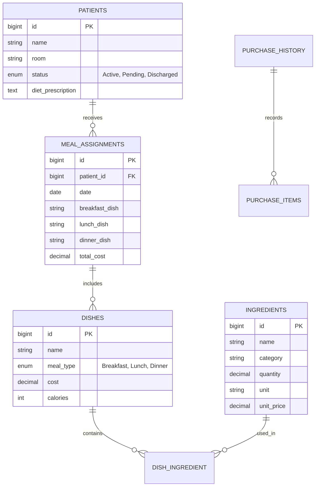

# Hospital Meal Planner & Inventory System (MOPH Manticao)
## Project Implementation Plan & Architecture Handbook

This document serves as the **shared context and roadmap** for the development of both the frontend (Vue 3) and backend (Laravel + MySQL) applications. Use this file to coordinate tasks, alignment, and vibe-coding sessions.

---

## 1. System Overview & JIT Model

Manticao Public Hospital (MOPH) uses a **Just-In-Time (JIT) procurement model**. 
* **No Large Warehouses:** The hospital does not store hundreds of kilograms of ingredients long-term. 
* **Daily Market Cycle:** 
  1. The **Dietitian** assigns meals to patients (budget limit: ₱150 per patient/day).
  2. The system aggregates all ingredients needed for those meals.
  3. A **Daily Market List** is generated for the **Purchasing Officer**.
  4. The Purchasing Officer buys ingredients at the market, logs the exact prices (receipts), and those items are added to stock.
  5. Once the **Kitchen Staff** finishes cooking, the ingredients are immediately **deducted** (backflushed).

---

## 2. Database Schema (MySQL)

We have created the migration files in the Laravel backend (`hospital-backend`). Here is the core structure of the tables:

---

## 3. Frontend Architecture

* **Framework:** Vue 3 (Vite) + TailwindCSS.
* **State Management:** Pinia (`src/stores/dataStore.js`).
* **Routing:** Vue Router (`src/router/index.js`).
* **API Integration Point:** Currently, `dataStore.js` uses `localStorage` for data persistence. This store must be updated to make HTTP requests (using Axios) to the Laravel backend.

---

## 4. Current Work: Backend To-Do List

For the developer continuing backend development:

### Step 1: Create Database Seeders
Seed the MySQL database with realistic initial data:
* **Dishes:** Regular dishes, low-sodium dishes, diabetic-friendly dishes.
* **Ingredients:** Rice, Chicken, Fish, Eggs, Vegetables, Cooking Oil, etc. (with mock stock quantities).

### Step 2: Build REST APIs
Build the following API endpoints in Laravel:
* **Authentication:** `POST /api/login` (Role-based: Dietitian, Purchasing Officer, Admissions, Kitchen Staff, Food Server).
* **Patients:** 
  * `GET /api/patients` (Filter active patients).
  * `POST /api/patients` (Register patient).
  * `PUT /api/patients/{id}` (Update info/discharge status).
* **Meal Assignments:**
  * `GET /api/meal-assignments` (Today's meal list).
  * `POST /api/meal-assignments` (Log a new daily assignment).
* **Purchasing & Receipts:**
  * `POST /api/purchases` (Submit logged receipts from market / unplanned purchases).
  * `GET /api/purchases/history` (Get purchase history).

### Step 3: Implement Backflushing (Stock Deduction)
* Create a controller method to calculate ingredient deductions.
* **Logic:** When the **Kitchen Staff** marks a production schedule as "Completed" for the day, the system must loop through all assigned meals for that day, find the corresponding ingredients (and quantities) for those dishes, and deduct those quantities from the `ingredients` table.

### Step 4: DOH Audit Reporting
* Create an endpoint to generate comprehensive reports for DOH (Department of Health) audits.
* **Logic:** The backend should compile data from `purchase_history` (expenses) and `meal_assignments` (budget adherence) and return a structured report matching the `DohReport.vue` requirements.

### Step 5: AI Food Exchange Chatbot Integration
* The Dietitian portal includes a "Food Exchange AI" tool.
* **Logic:** Create a Laravel service that connects to an LLM API (like OpenAI or Gemini). Expose an endpoint (`POST /api/chat/food-exchange`) that takes a dietitian's query (e.g., "What can I substitute for 100g of pork?") and returns nutritional equivalents based on Philippine Food Exchange lists.

### Step 6: Database Triggers & Observers (Automation)
* Use Laravel Observers (or MySQL triggers) to automate background tasks.
* **Example 1:** When a patient's status changes to "Discharged", automatically trigger a job to cancel any future `meal_assignments`.
* **Example 2:** When a `purchase_history` record is inserted, automatically log an entry in the system activity logs.

---

## 5. How to Connect Frontend to Backend

1. In the Vue frontend, install Axios: `npm install axios`.
2. Configure a base API utility file (e.g., `src/utils/api.js`) pointing to `http://localhost:8000/api`.
3. Modify `src/stores/dataStore.js` to dispatch async actions using Axios instead of writing directly to `localStorage`.
